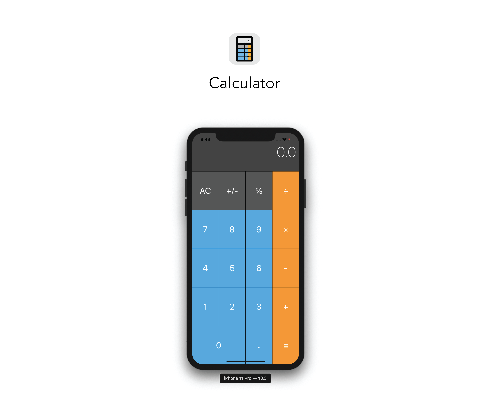

# Calculator
> Calculator IOS App Developed With SwiftUI.

[![Swift5 compatible][Swift5Badge]][Swift5Link]
[](http://cocoapods.org/pods/LFAlertController)

<div> 
</img>
</div>

## Features

- [x] Fast 
- [x] Easy To Use
- [x] Multiple Calculation
- [x] Scientific
- [x] Free

## Requirements

- iOS 8.0+
- Xcode 11.0+

## Installation

#### CocoaPods
You can use [CocoaPods](http://cocoapods.org/) to install Project by adding it to your `Podfile`:

```ruby
platform :ios, '8.0'
use_frameworks!
pod 'CalculatorIOSApp'
```

To get the full benefits import Project wherever you import UIKit

``` swift
import UIKit
import CalculatorIOSApp
```
#### Manually
1. Download and drop ```Calculator.swift``` in your project.  
2. Congratulations!  

## Usage example

```swift
import EZSwiftExtensions
ez.detectScreenShot { () -> () in
    print("User took a screen shot")
}
```

## Contribute

We would love you for the contribution to **CalculatorIOSApp**, check the ``LICENSE`` file for more info.

## Meta

Nitin – nitin.birdi@icloud.com
